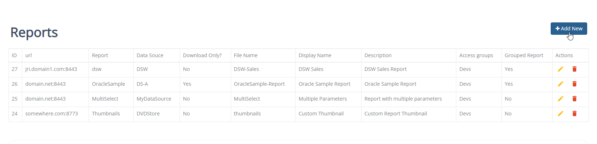

.. This is a comment. Note how any initial comments are moved by
   transforms to after the document title, subtitle, and docinfo.

.. demo.rst from: http://docutils.sourceforge.net/docs/user/rst/demo.txt

.. |EXAMPLE| image:: static/yi_jing_01_chien.jpg
   :width: 1em

**********************
Reports
**********************

.. contents:: Table of Contents
Overview
==================

You can view, add, and edit reports via the Reports menu.

Add New Report
================

To add a new report, click the "Add New" button at top.

Enter the following information:

* url	
* Report	
* Data Souce	
* Download Only 
* File Name	
* Name	
* Description	
* Access Groups	
* Grouped Report

Url
===================
Full url to your JRI installation

Report
===================
This is the name of the jrxml file

Data Source
===================
The JRI Data Source name

Download Only
===================
The Download Only option is used primarily for two reasons.

1.  The report contains charts which do not render in HTML
2.  You want the chart to be downloaded immediately.

Name
===================
This is the name you wish to appear in the dashboard

Descruption 
===================
This is the description that will appear in the dashboard

Grouped Report
===================
Report is part of Grouped Report   

