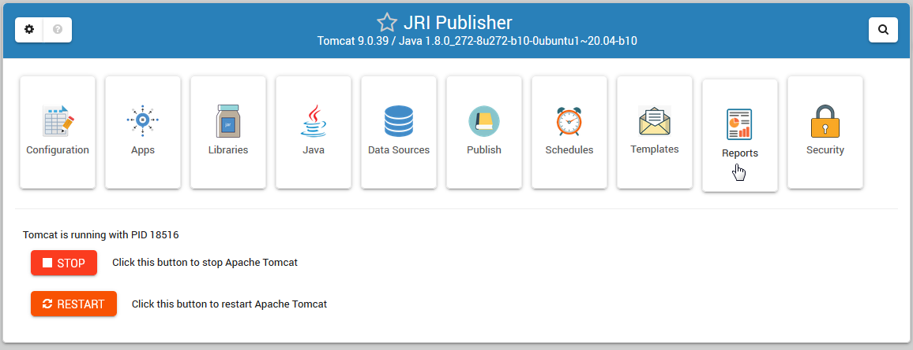

Intro
===========================

Overview
------------

JRI Viewer is a stand-alone Pg-PHP application for viewing and exporting Jasper Reports on demand.

It does not require JRI Publisher and can be used with any (and multiple) instances of `JasperReportsIntegration`_

.. _`JasperReportsIntegration`: https://github.com/daust/JasperReportsIntegration 

It also provides Publishing, Scheduling, Email Formatting, and Report Management.

It can be used with or without Oracle APEX.

In additional to Oracle, JRI Publisher includes one-click JNDI support for PostgreSQL, MySQL, and SQL Server.

System Requirements
-------------------
* CentOS 7 or 
* Ubuntu 22
* PostgreSQL
* PHP

Authors
-------
* `David Ghedini`_
* `Kaloyan Petrov`_

.. _`David Ghedini`: https://github.com/DavidGhedini
.. _`Kaloyan Petrov`: https://github.com/kaloyan13

Open Source
-----------

JRI Publisher is Free, Open Source Software.

GNU GENERAL PUBLIC LICENSE v3

    

